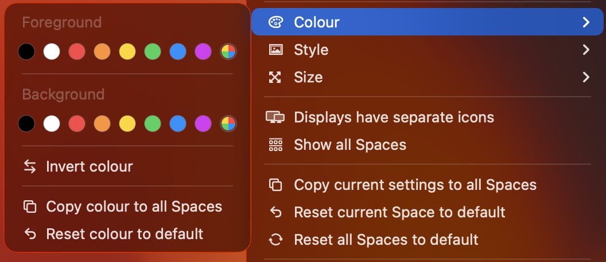
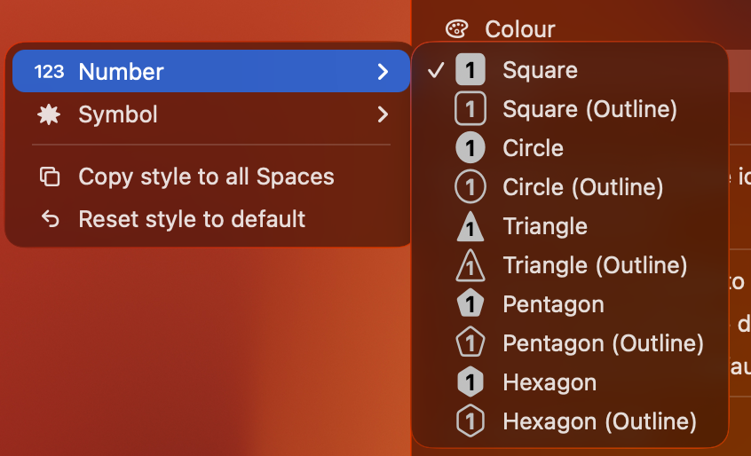
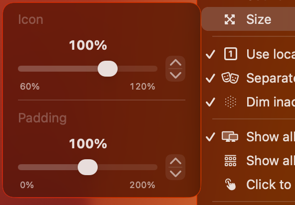

# WhichSpace

Have you ever forgotten _which space_ is currently active on macOS and wanted a quick way to tell? Didn't think so... but I did!


## Overview

- **Multiple Spaces** - Show current Space only, or all Spaces at once
- **Multiple Displays** - Show Spaces across multiple monitors
- **Click-to-Switch** - Jump to any Space directly from the menu bar
- **Colors** - Set foreground and background colors per Space
- **Icons** - Choose from multiple icon styles (square, circle, triangle, and more)
- **Symbols** - Use native macOS symbols instead of numbers
- **Emojis** - Use emojis to get even more creative
- **Size** - Scale icons to your preference
- **Sound** - Play a sound when switching Spaces
- **AppleScript** - Automate with scripting support
- **Launch at Login** - Start automatically with macOS
- **Auto-Updates** - Stay up-to-date with automatic updates
- **Languages** - Translated into multiple languages

## Installation

### Homebrew _(recommended)_

```text
brew install --cask gechr/tap/whichspace
```

> [!IMPORTANT]
> If you previously installed via `brew install --cask whichspace`, uninstall it first with `brew uninstall --cask whichspace`

---

### GitHub

- Download [`WhichSpace.zip`](https://github.com/gechr/WhichSpace/releases/latest/download/WhichSpace.zip)
- Extract `WhichSpace.zip` and run `WhichSpace.app`
- Future updates will be handled automatically

> [!IMPORTANT]
> Since `WhichSpace.app` is not [notarized](https://developer.apple.com/documentation/security/notarizing-macos-software-before-distribution), macOS may show a warning along the lines of:
>
> > **Apple could not verify "WhichSpace.app" is free of malware that may harm your Mac or compromise your privacy.**
>
> To bypass this, run the following command in [Terminal](https://support.apple.com/en-gb/guide/terminal/welcome/mac):
>
> ```text
> xattr -r -d com.apple.quarantine /path/to/WhichSpace.app
> ```
>
> Or right-click the app and select "Open" to add an exception.

## Features

### Spaces

#### Show the current Space only, or choose to show all Spaces


#### Click on a Space to switch to it


> [!NOTE]
> Inactive Spaces are dimmed by default.

### Displays

#### Show the current Display only, or choose to show all Displays


> [!NOTE]
> A vertical separator is shown between Displays.
>
> Full-screen apps are shown as **F** and can be hidden entirely.

### Colors

#### Choose foreground and background colors for each Space, or apply one color to all Spaces



### Icons

#### Choose from a variety of icons for each Space, or apply one icon to all Spaces



### Symbols

#### Use custom symbols instead of numbers for a more personalised look


### Size

#### Adjust the scale of the icons in the menu bar



## Scripting

#### Use AppleScript for automation

```bash
# Get the current space number (1-based numeric index)
osascript -e 'tell application "WhichSpace" to get current space number'

# Get the current space label (as shown in the menu bar, e.g. "1", "2", "F" for fullscreen)
osascript -e 'tell application "WhichSpace" to get current space label'
```
