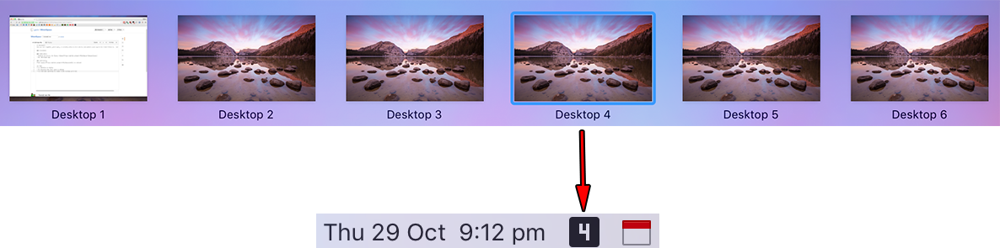
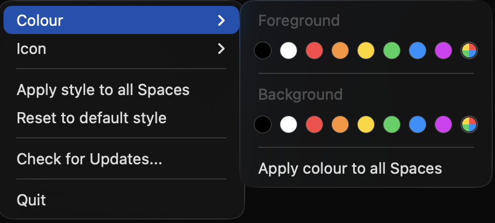
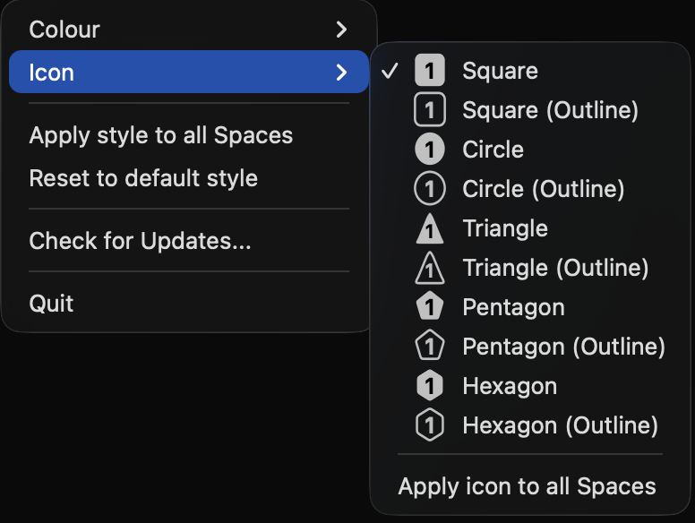
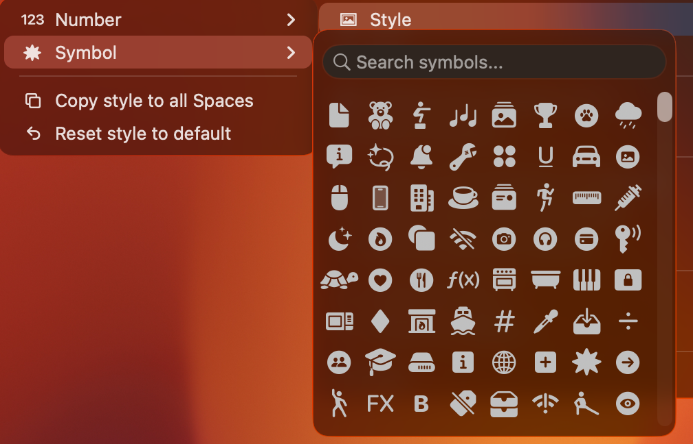

# WhichSpace

Have you ever forgotten _which space_ is currently active on macOS and wanted a quick way to tell? Didn't think so... but I did!



## Features

### Colours

Choose foreground and background colours for each space, or apply one colour to all spaces:



### Icons

Choose from a variety of icons for each space, or apply one icon to all spaces:



### Symbols

Use custom symbols instead of numbers for a more personalised look:



## Installation

### Homebrew (recommended)

```text
brew install --cask whichspace
```

#### GitHub

* Download and extract the [latest release](https://github.com/gechr/WhichSpace/releases/latest)
* Run `WhichSpace.app`

> [!WARNING]
> Since the app is not notarized, macOS will show a warning: _"WhichSpace.app" cannot be opened because Apple cannot check it for malicious software._
>
> To bypass this, run the following command in Terminal:
> ```
> xattr -cr /path/to/WhichSpace.app
> ```
> Or right-click the app and select "Open" to add an exception.

## Contributing

[Pull requests](https://github.com/gechr/WhichSpace/pulls) are welcome!
