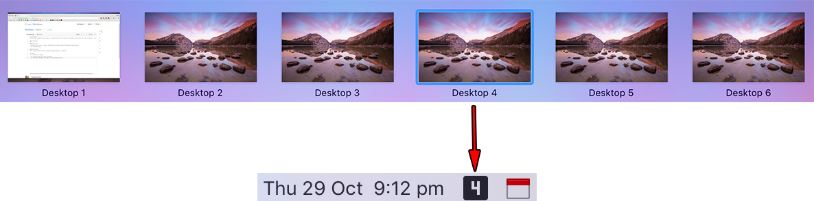
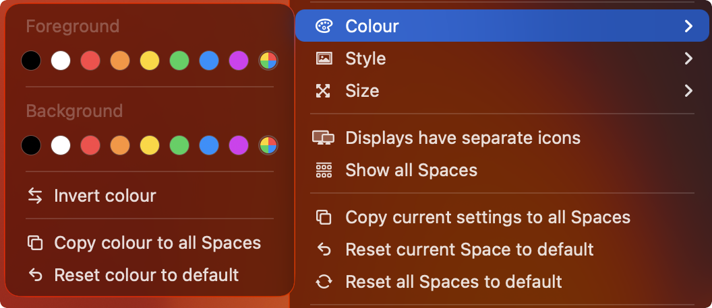
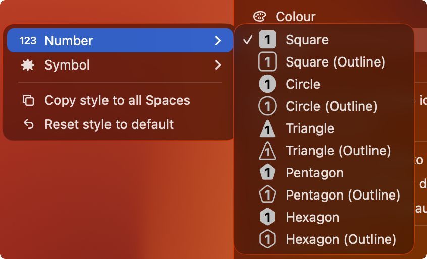
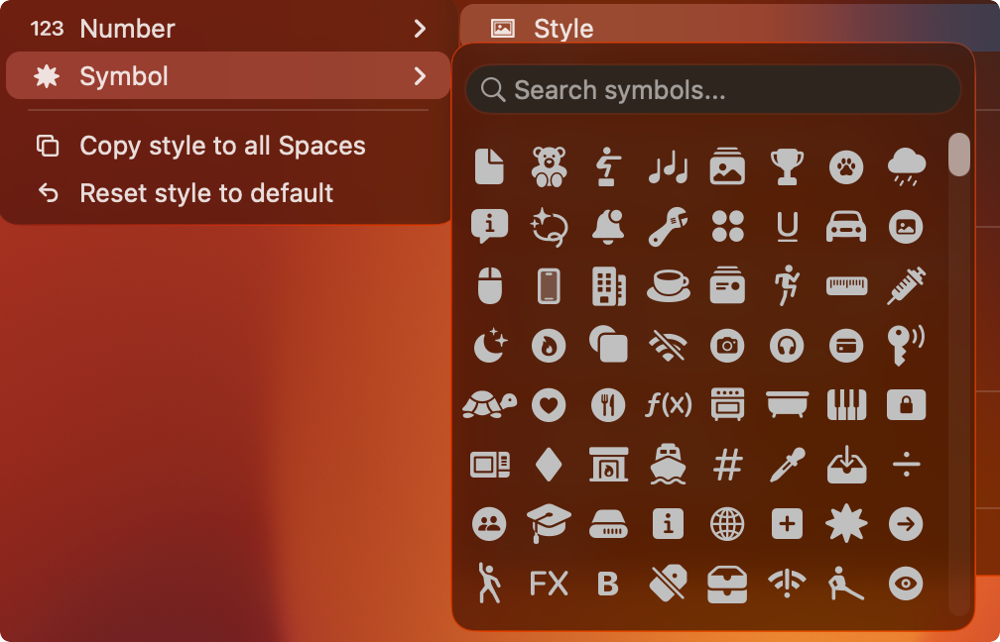
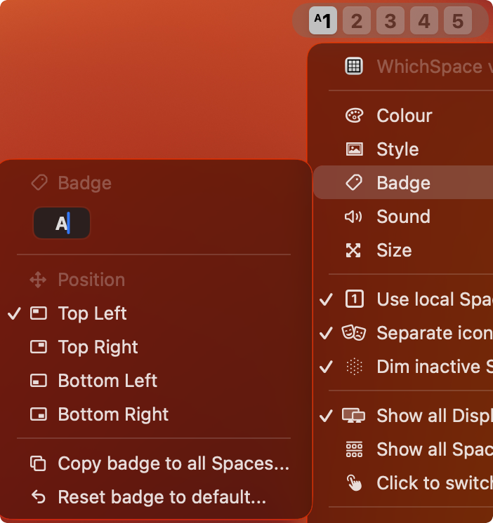
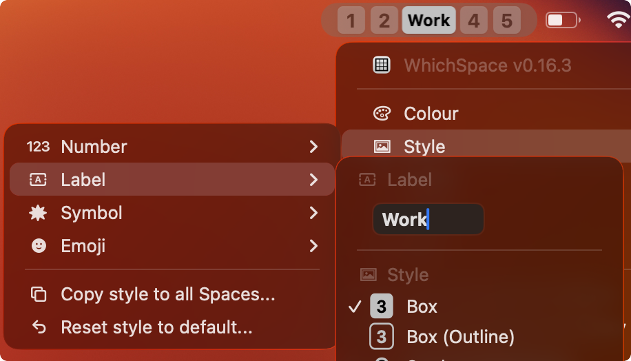
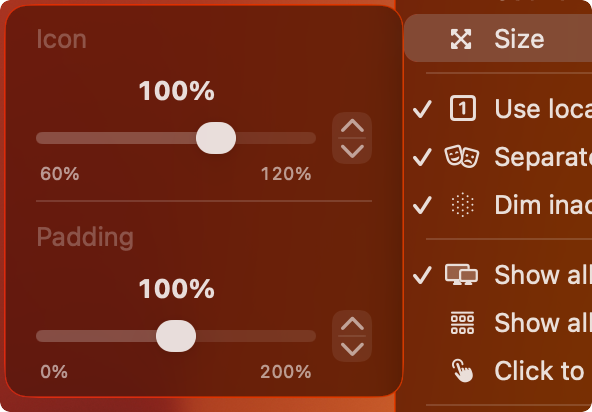

# WhichSpace

Have you ever forgotten _which space_ is currently active on macOS and wanted a quick way to tell? Didn't think so... but I did!



## Overview

- **Multiple Spaces** - Show current Space only, or all Spaces at once
- **Multiple Displays** - Show Spaces across multiple monitors
- **Click-to-Switch** - Jump to any Space directly from the menu bar
- **Scroll-to-Switch** - Cycle through Spaces by scrolling over the menu bar icon
- **Colors** - Set foreground and background colors per Space
- **Icons** - Choose from multiple icon styles (square, circle, triangle, and more)
- **Labels** - Replace Space numbers with custom text labels
- **Symbols** - Use native macOS symbols instead of numbers
- **Emojis** - Use emojis to get even more creative
- **Badges** - Add a small character of your choice next to the Space number
- **Size** - Scale icons to your preference
- **Sound** - Play a sound when switching Spaces
- **Shortcuts** - Native actions for the Shortcuts app
- **AppleScript** - Automate with scripting support
- **Launch at Login** - Start automatically with macOS
- **Auto-Updates** - Stay up-to-date with automatic updates
- **Languages** - Translated into multiple languages

## Installation

### Homebrew _(recommended)_

```text
brew install --cask whichspace
```

### GitHub

- Download [`WhichSpace.zip`](https://github.com/gechr/WhichSpace/releases/latest/download/WhichSpace.zip)
- Extract `WhichSpace.zip` and run `WhichSpace.app`
- Future updates will be handled automatically

## Features

### Spaces

#### Show the current Space only, or choose to show all Spaces


#### Click on a Space to switch to it


> [!NOTE]
> Inactive Spaces are dimmed by default.
>
> Empty Spaces can be hidden entirely.

### Displays

#### Show the current Display only, or choose to show all Displays


> [!NOTE]
> A vertical separator is shown between Displays.
>
> Full-screen apps are shown as their app icon (or **F**) and can be hidden entirely.

### Colors

#### Choose foreground and background colors for each Space, or apply one color to all Spaces



### Icons

#### Choose from a variety of icons for each Space, or apply one icon to all Spaces



### Symbols

#### Use custom symbols instead of numbers for a more personalised look



### Badges

#### Add a small character next to the Space number



> [!NOTE]
> Use `#` as the badge character to insert the current Space number.

### Labels

#### Replace Space numbers with custom text labels



> [!NOTE]
> Use `{number}` in a label to insert the current Space number, e.g. `{number} - Work` → `3 - Work`.

### Size

#### Adjust the scale and padding of the icons in the menu bar



### Sounds

#### Play a sound when switching Spaces

Choose from built-in macOS system sounds, or add your own custom sounds.

To add a custom sound:

1. Create the `~/Library/Sounds` directory (if it doesn't already exist)
2. Copy your sound file into the directory
3. The sound will appear under the **User** section in the Sound menu

### Shortcuts

#### Automate WhichSpace with Shortcuts

WhichSpace provides native actions in the [Shortcuts](https://support.apple.com/guide/shortcuts-mac/apdf22b0444c/mac) app - open Shortcuts, create a shortcut, and search for "WhichSpace":

- **Switch Space** - switch to a Space by number, optionally applying a label and badge in one step
- **Switch to Next Space** / **Previous Space** - move one Space left or right
- **Get Current Space Number** / **Label** / **Badge** - read the current Space state into a shortcut
- **Set Current Space Label** / **Badge** - apply a custom label or badge
- **Reset Current Space Label** / **Badge** - revert the current Space to its default
- **Reset All Space Labels** / **Badges** - revert every Space at once

"Switch Space" and "Get Current Space Number" are also available directly from Spotlight and Siri.

### Scripting

#### Automate WhichSpace with AppleScript

##### Switching

```bash
# Switch to a specific Space on the current display
osascript -e 'tell application "WhichSpace" to switch to space number 3'

# Switch to a Space and apply a label in one step
osascript -e 'tell application "WhichSpace" to switch to space number 3 label "Work"'

# Switch to a Space and apply a badge in one step
osascript -e 'tell application "WhichSpace" to switch to space number 3 badge "A"'

# Switch to the next or previous Space on the current display
osascript -e 'tell application "WhichSpace" to switch to next space'
osascript -e 'tell application "WhichSpace" to switch to previous space'
```

##### Spaces

```bash
# Get the current Space number (1-based numeric index)
osascript -e 'tell application "WhichSpace" to get current space number'
```

##### Labels

```bash
# Get the current Space label (as shown in the menu bar, e.g. "1", "2", "F" for fullscreen)
osascript -e 'tell application "WhichSpace" to get current space label'

# Set a custom label for the current Space
osascript -e 'tell application "WhichSpace" to set current space label to "Work"'

# Reset the current Space label to its default (e.g. the Space number)
osascript -e 'tell application "WhichSpace" to reset current space label'

# Reset the labels of all Spaces to their defaults
osascript -e 'tell application "WhichSpace" to reset all space labels'
```

##### Badges

```bash
# Get the current Space badge character
osascript -e 'tell application "WhichSpace" to get current space badge'

# Set a single-character badge for the current Space ("#" shows the Space number)
osascript -e 'tell application "WhichSpace" to set current space badge to "A"'

# Reset the current Space badge to its default
osascript -e 'tell application "WhichSpace" to reset current space badge'

# Reset the badges of all Spaces to their defaults
osascript -e 'tell application "WhichSpace" to reset all space badges'
```
