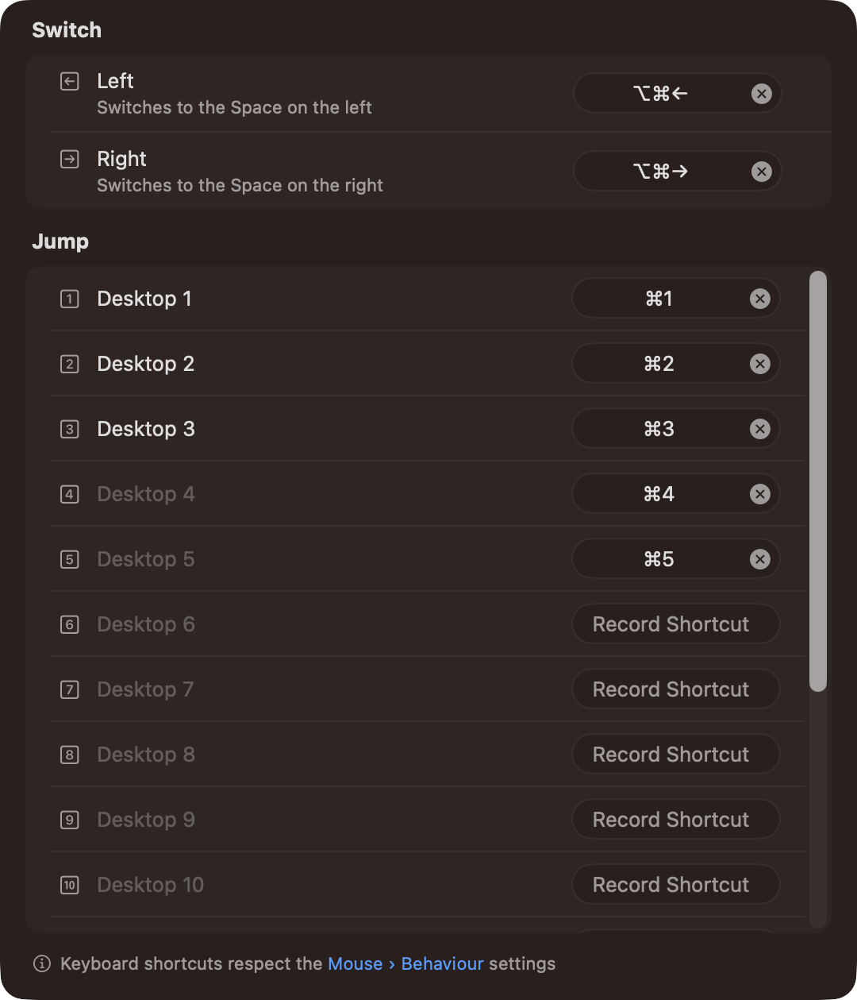

# WhichSpace

Have you ever forgotten _which space_ is currently active on macOS and wanted a quick way to tell? Didn't think so... but I did!


## Overview

- [**Multiple Spaces**](#spaces) - Show current Space only, or all Spaces at once
- [**Multiple Displays**](#displays) - Include Spaces from every display in the menu bar icon
- [**Click-to-Switch**](#click-on-a-space-to-switch-to-it) - Jump to any Space directly from the menu bar
- [**Move Windows**](#moving-windows) - Send the front window to another Space
- [**Scroll-to-Switch**](#click-on-a-space-to-switch-to-it) - Cycle through Spaces by scrolling over the menu bar icon
- [**Colors**](#colors) - Set foreground and background colors per Space
- [**Icons**](#icons) - Choose from multiple icon styles (square, circle, triangle, and more)
- [**Labels**](#labels) - Replace Space numbers with custom text labels
- [**Symbols**](#symbols) - Use native macOS symbols instead of numbers
- [**Emojis**](#symbols) - Use emojis to get even more creative
- [**Badges**](#badges) - Add a small character of your choice next to the Space number
- [**Size**](#size) - Scale icons to your preference
- [**Fonts**](#fonts) - Choose a custom font per Space
- [**Keybinds**](#keybinds) - Global keyboard shortcuts to switch to any Space
- [**Sound**](#sounds) - Play a sound when switching Spaces
- [**Shortcuts**](#shortcuts) - Native actions for the Shortcuts app
- [**AppleScript**](#scripting) - Automate with scripting support
- [**URL Scheme**](#url-scheme) - Control via `whichspace://` links
- **Launch at Login** - Start automatically with macOS
- **Auto-Updates** - Stay up-to-date with automatic updates
- **Localization** - Translated into multiple languages

## Installation

### Homebrew _(recommended)_

```text
brew install --cask whichspace
```

### GitHub

- Download [`WhichSpace.zip`](https://github.com/gechr/WhichSpace/releases/latest/download/WhichSpace.zip)
- Extract `WhichSpace.zip` and run `WhichSpace.app`
- Future updates will be handled automatically

## Features

### Spaces

#### Show only the active Space, or every Space


#### Click on a Space to switch to it


> [!NOTE]
> Inactive Spaces are dimmed by default.
>
> Empty Spaces can be hidden entirely.

---

### Displays

#### Include Spaces from your other Displays, or just the current one


> [!NOTE]
> macOS allows an app only one menu bar item, mirrored on every display, so WhichSpace cannot show a different number on each monitor. This setting draws every display's Spaces into that one item.
>
> A vertical separator is shown between Displays.
>
> Full-screen apps are shown as their app icon (or **F**) and can be hidden entirely.

---

### Colors

#### Choose foreground and background colors for each Space, or apply one color to all Spaces


---

### Icons

#### Choose from a variety of icons for each Space, or apply one icon to all Spaces


---

### Symbols

#### Use custom symbols instead of numbers for a more personalised look


#### Or pick an emoji instead


---

### Badges

#### Add a small character next to the Space number


> [!NOTE]
> Use `#` as the badge character to insert the current Space number.

---

### Labels

#### Replace Space numbers with custom text labels


> [!NOTE]
> Use `{#}` in a label to insert the current Space number, e.g. `{#} - Work` → `3 - Work`.

---

### Size

#### Adjust the scale and padding of the icons in the menu bar


---

### Fonts

#### Choose a custom font for each Space, or apply one font to all Spaces


---

### Keybinds

#### Switch Spaces or move windows with global keyboard shortcuts



> [!NOTE]
> The **Window** shortcuts move the front window between Spaces.
>
> **Send** leaves you on the current Space, while **Move** follows the window there.

---

### Sounds

#### Play a sound when switching Spaces


Choose from built-in macOS system sounds, or add your own custom sounds.

To add a custom sound:

1. Create the `~/Library/Sounds` directory (if it doesn't already exist)
2. Copy your sound file into the directory
3. The sound will appear under the **User** section in the Sound menu

---

### Shortcuts

#### Automate WhichSpace with Shortcuts

WhichSpace provides native actions in the [Shortcuts](https://support.apple.com/guide/shortcuts-mac/apdf22b0444c/mac) app - open Shortcuts, create a shortcut, and search for "WhichSpace":

- **Switch Space** - switch to a Space by number, optionally applying a label and badge in one step
- **Switch Left** / **Switch Right** - switch one Space in either direction
- **Switch to Previous Space** - switch back to the last visited Space
- **Move Window to Space** - move the front window to a Space by number, optionally following it there
- **Move Window Left** / **Move Window Right** - move the front window one Space in either direction
- **Get Current Space Number** / **Label** / **Badge** - read the current Space state into a shortcut
- **Set Current Space Label** / **Badge** - apply a custom label or badge
- **Reset Current Space Label** / **Badge** - revert the current Space to its default
- **Reset All Space Labels** / **Badges** - revert every Space at once

"Switch Space" and "Get Current Space Number" are also available directly from Spotlight and Siri.

AppleScript exposes the same state through `space` and `display` objects. Setting a label or badge to "" resets a single Space, and the `reset all space labels` / `reset all space badges` commands mirror the **Reset All** actions.

---

### Scripting

#### Automate WhichSpace with AppleScript

##### Switching

```bash
# Switch to a specific Space by number
osascript -e 'tell application "WhichSpace" to switch to space number 3'

# Switch to a Space and apply a label in one step
osascript -e 'tell application "WhichSpace" to switch to space number 3 label "Work"'

# Switch to a Space and apply a badge in one step
osascript -e 'tell application "WhichSpace" to switch to space number 3 badge "A"'

# Switch one Space to the left or right
osascript -e 'tell application "WhichSpace" to switch left'
osascript -e 'tell application "WhichSpace" to switch right'

# Switch back to the last visited Space
osascript -e 'tell application "WhichSpace" to switch to previous space'
```

##### Moving windows

`send` does not switch Space. `move` follows the window.

```bash
# Send the front window to a Space, without switching Space
osascript -e 'tell application "WhichSpace" to send front window to space number 3'

# Move the front window to a Space and switch to it
osascript -e 'tell application "WhichSpace" to move front window to space number 3'

# Send or move the front window one Space to the left or right
osascript -e 'tell application "WhichSpace" to send front window left'
osascript -e 'tell application "WhichSpace" to move front window right'
```

> [!NOTE]
> Requires macOS Sonoma, or Tahoe 26.4 and later. Unsupported on Sequoia.

##### Spaces

Spaces are objects: `space N` addresses the current display, `space N of display M` addresses another display, and `current space` is the Space you are on. Positions are fixed per display, unaffected by the numbering preference.

```bash
# Get the current Space number (1-based numeric index)
osascript -e 'tell application "WhichSpace" to get current space number'

# Count the Spaces on the current display, or on another display
osascript -e 'tell application "WhichSpace" to count spaces'
osascript -e 'tell application "WhichSpace" to count spaces of display 2'

# Get the current Space as an object, e.g. `space 3 of application "WhichSpace"`
osascript -e 'tell application "WhichSpace" to get current space'

# Get the labels of all Spaces on the current display, in order
osascript -e 'tell application "WhichSpace" to get label of every space'

# Get the badges of all Spaces on the current display, in the same order
osascript -e 'tell application "WhichSpace" to get badge of every space'
```

##### Labels

```bash
# Get the current Space label (as shown in the menu bar, e.g. "1", "2", "F" for fullscreen)
osascript -e 'tell application "WhichSpace" to get label of current space'

# Set a custom label for the current Space
osascript -e 'tell application "WhichSpace" to set label of current space to "Work"'

# Set a custom label for any Space, without switching to it
osascript -e 'tell application "WhichSpace" to set label of space 3 to "Mail"'

# Reset a Space label to its default (e.g. the Space number)
osascript -e 'tell application "WhichSpace" to set label of space 3 to ""'

# Reset the labels of all Spaces on every display to their defaults
osascript -e 'tell application "WhichSpace" to reset all space labels'
```

##### Badges

```bash
# Get the current Space badge character
osascript -e 'tell application "WhichSpace" to get badge of current space'

# Set a single-character badge for any Space ("#" shows the Space number)
osascript -e 'tell application "WhichSpace" to set badge of current space to "A"'
osascript -e 'tell application "WhichSpace" to set badge of space 2 to "#"'

# Reset a Space badge to its default
osascript -e 'tell application "WhichSpace" to set badge of space 2 to ""'

# Reset the badges of all Spaces on every display to their defaults
osascript -e 'tell application "WhichSpace" to reset all space badges'
```

##### Diagnostics

```bash
# Copy a summary of your setup to the clipboard, and print it
osascript -e 'tell application "WhichSpace" to copy diagnostics'
```

##### Displays

Displays are numbered in the same order as the display picker in WhichSpace settings.

```bash
# Get the system names of all displays, e.g. "Built-in Retina Display"
osascript -e 'tell application "WhichSpace" to get name of every display'

# Address a Space on a specific display
osascript -e 'tell application "WhichSpace" to set label of space 2 of display 2 to "Mail"'

# Read every Space label on a specific display
osascript -e 'tell application "WhichSpace" to get label of every space of display 2'
```

---

### URL Scheme

#### Automate WhichSpace from anywhere

```bash
# Switch to a specific Space by number
open "whichspace://switch/3"

# Switch to a Space and apply a label and badge in one step
open "whichspace://switch/3?label=Work&badge=A"

# Switch one Space to the left or right
open "whichspace://switch/left"
open "whichspace://switch/right"

# Switch back to the last visited Space
open "whichspace://switch/previous"

# Send the front window to a Space, without switching Space
open "whichspace://send/3"

# Move the front window to a Space and switch to it
open "whichspace://move/3"

# Send or move the front window one Space to the left or right
open "whichspace://send/left"
open "whichspace://move/right"

# Copy a summary of your setup, ready to paste into a bug report
open "whichspace://diagnostics/copy"
```
